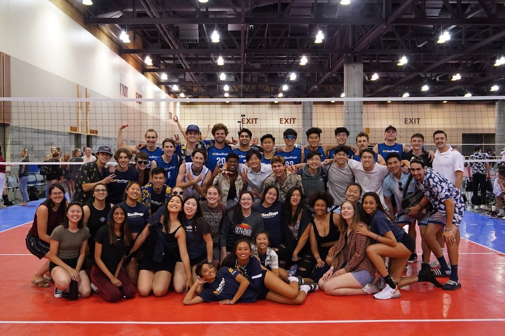

# Bryan Lee's User Page

## Introduction

Hello! My name is **Bryan Lee** and I am a third year Math-CS Major in Revelle College. In my free time, I love playing basketball and volleyball and hanging out with my friends. 

## Programming Background

I have been coding since my senior year of college and my main interests are in mobile and web development. I have experience in several programming languages, including:

- Java
- Python
- HTML/CSS
- JavaScript

[Here is a link to my resume!](Bryan_Lee_Resume_Final_Nov11.pdf)

## Projects

Here are some projects I have worked on:

1. **Mobile App**: I developed a mobile app using Java for my final project in my mobile development course. The app is a fitness tracker that allows users to track their daily workouts and set fitness goals.

2. **Web App**: I worked on a web development project with a team of four. We created a platform that connects local farmers with consumers in the area. I was responsible for the frontend development using HTML/CSS and JavaScript.

## Favorite Quotes

> "The greatest glory in living lies not in never falling, but in rising every time we fall." -Nelson Mandela

## Links

- [My GitHub Profile](https://github.com/bryan901)
- [My Linkedin Profile](https://www.linkedin.com/in/bryan-lee-55310a206/)

## Goals

Here are some of my professional goals:

- [ ] get summer internship
- [ ] end with an A in cse110

## Contact Information

If you have any questions or would like to contact me, please email me at bhlee@ucsd.edu. 

Thanks for visiting my page!